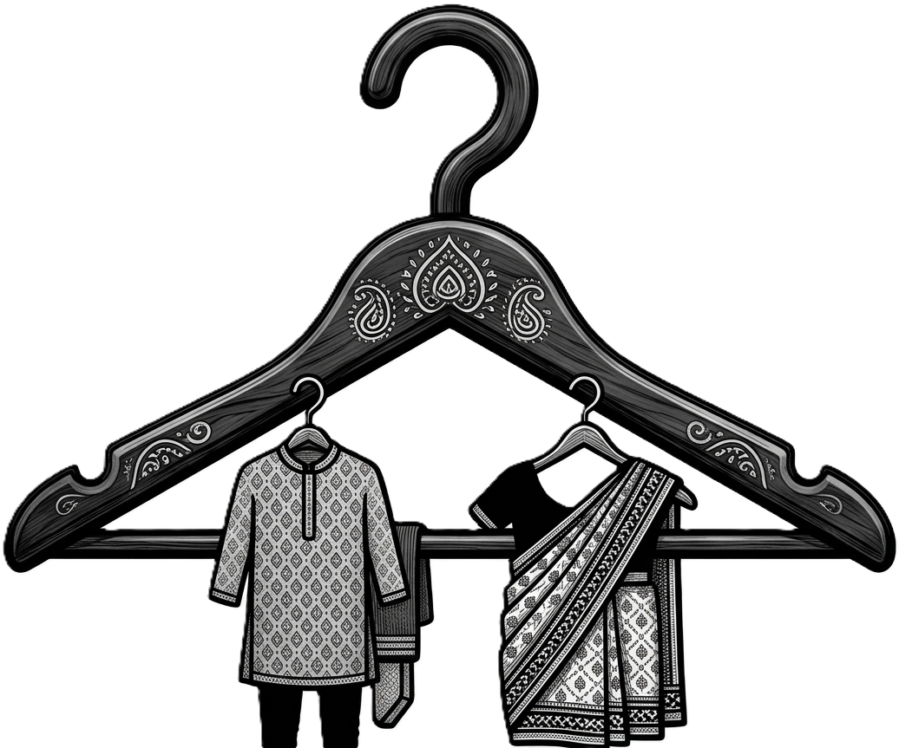
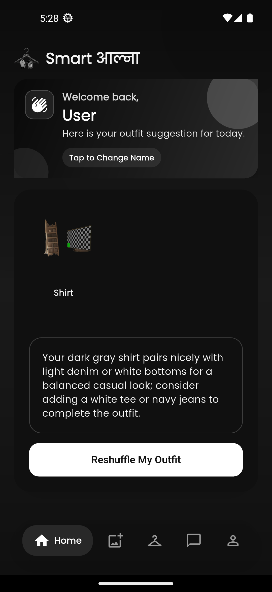
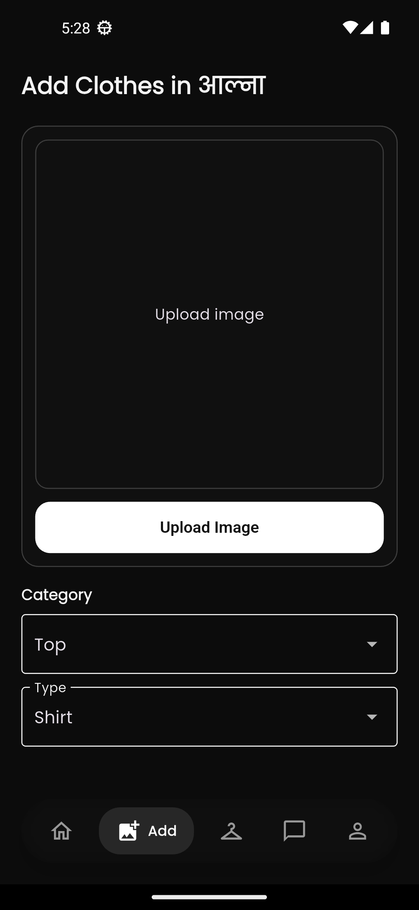
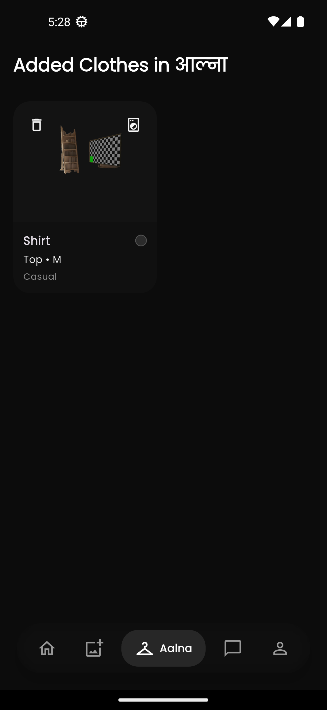
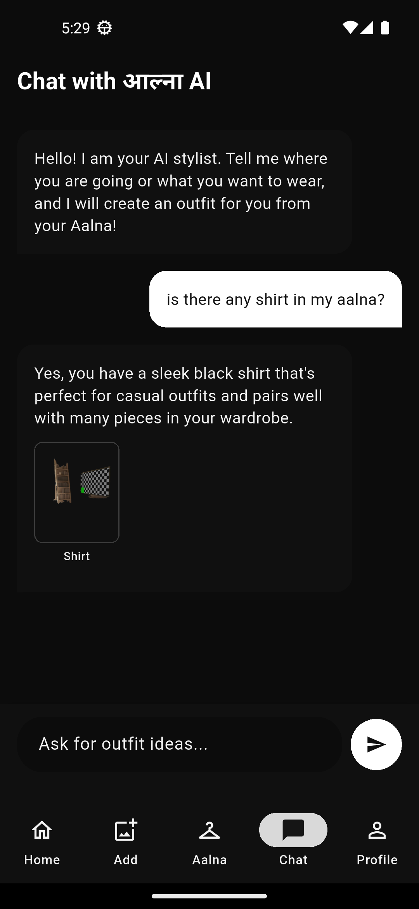
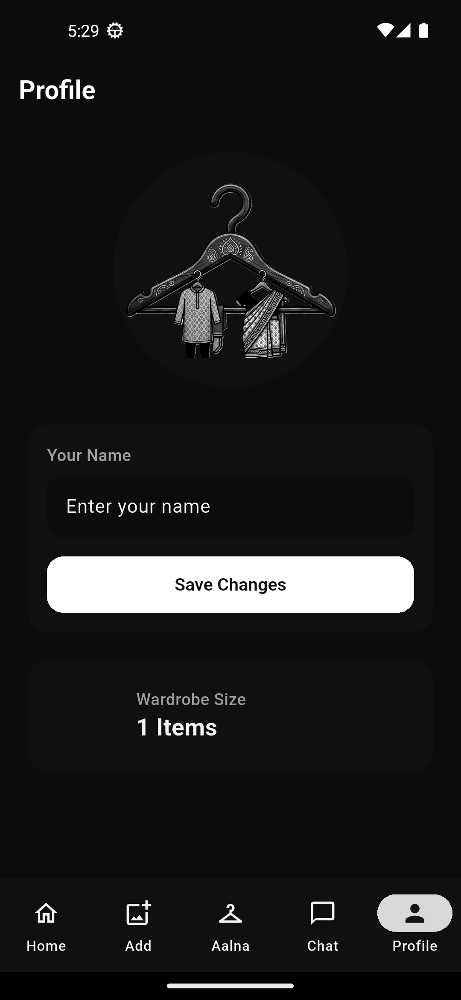

<div align="center">
  

# Smart Aalna (Smart आल्ना)

A modern, intelligent digital wardrobe management and fashion assistant application built with Flutter.

</div>

---

## Overview

Smart Aalna is a comprehensive digital wardrobe solution designed to help users digitize their clothing collections, plan outfits, and receive intelligent fashion recommendations. By combining an intuitive user interface with local data management and AI-driven insights, Smart Aalna acts as a personal pocket stylist.

## Key Features

- **Digital Wardrobe Management**: Easily add, view, and organize your clothing items.
- **Advanced Item Categorization**: Categorize clothes by type (top, bottom, outerwear), size, occasion, season, pattern, and color.
- **Intelligent Image Processing**: Built-in background removal and color extraction directly from uploaded clothing images.
- **AI Fashion Assistant**: Integrated AI chat to provide personalized outfit recommendations and style advice.
- **Status Tracking**: Mark items as favorites or in the laundry to keep your active wardrobe up to date.
- **Modern User Interface**: A polished, responsive design utilizing Material 3, custom typography (Google Fonts), fluid animations, and a dynamic floating navigation bar.
- **Dark and Light Mode**: Full support for system-integrated themes.

## Screenshots

<div align="center">
  <table>
    <tr>
      <td align="center">
        <b>Home</b><br/>
        
      </td>
      <td align="center">
        <b>Add Clothes</b><br/>
        
      </td>
      <td align="center">
        <b>Aalna</b><br/>
        
      </td>
    </tr>
    <tr>
      <td align="center">
        <b>AI Assistant</b><br/>
        
      </td>
      <td align="center">
        <b>Profile</b><br/>
        
      </td>
      <!-- Empty cell to balance the grid -->
      <td></td>
    </tr>
  </table>
</div>

## Technical Stack

- **Framework**: Flutter / Dart
- **Design System**: Material 3
- **Local Storage**: Shared Preferences / Local JSON storage
- **State Management**: ValueNotifier / FutureBuilder
- **AI Integration**: Generative AI / ONNX Runtime (for local image processing)

## Getting Started

### Prerequisites

- Flutter SDK (latest stable release recommended)
- Dart SDK
- Android Studio or Xcode (for iOS deployment)
- An active emulator or connected device

### Installation

1. Clone the repository:

   ```bash
   git clone <repository-url>
   cd smart_aalna
   ```

2. Install dependencies:

   ```bash
   flutter pub get
   ```

3. Run the application:
   ```bash
   flutter run
   ```

## Project Structure

```text
lib/
  ├── core/            # Core utilities, theme configurations, and reusable widgets
  ├── features/        # Feature-based module separation
  │   ├── home/        # Main dashboard, wardrobe grid, and cloth addition logic
  │   ├── chat/        # AI Fashion Assistant interface
  │   └── profile/     # User profile and application settings
  └── main.dart        # Application entry point and routing setup
```

## Building for Production

To build a release APK with split architectures for optimal performance on Android:

```bash
flutter build apk --split-per-abi
```

The output files will be located in `build/app/outputs/flutter-apk/`.

## License

This project is open source. Contributions are welcome, but please open an issue or contact the developer before making major changes.

## Developer

Maintained by <a href="https://www.abhishek-sharma.com.np/" target="_blank">Abhishek Sharma</a>.
